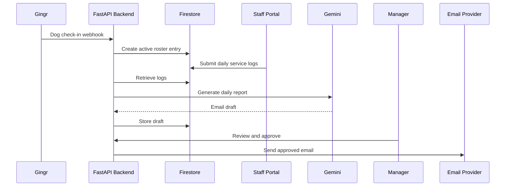
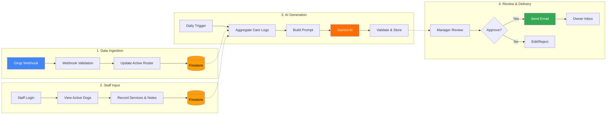
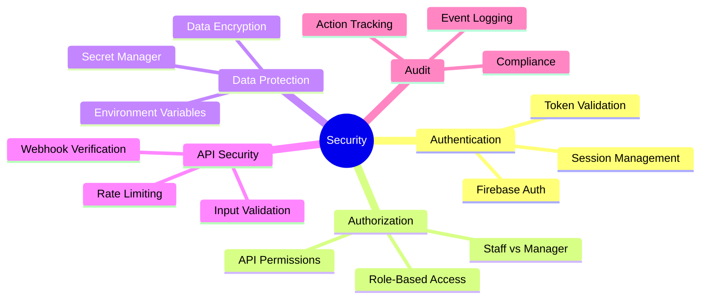
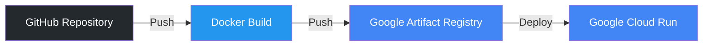

<!-- Header -->
<div align="center">
  
  
  
  
  <br />
  
  
  
  <p align="center">
    <strong>An AI-powered, cloud-native platform that automates personalized daily updates for dog owners by integrating with an existing pet-care CRM and providing a custom operational workflow for staff.</strong>
  </p>
  
</div>

<div align="center"> <table> <tr> <td align="center" colspan="3"><strong>🖥️ Frontend</strong></td> </tr> <tr> <td align="center"> <br/> <strong>Next.js</strong><br/> <sub>Framework</sub> </td> <td align="center"> <br/> <strong>React</strong><br/> <sub>UI Library</sub> </td> <td align="center"> <br/> <strong>TypeScript</strong><br/> <sub>Language</sub> </td> </tr> <tr> <td colspan="3"><br/></td> </tr> <tr> <td align="center" colspan="3"><strong>⚙️ Backend</strong></td> </tr> <tr> <td align="center"> <br/> <strong>Python</strong><br/> <sub>Language</sub> </td> <td align="center"> <br/> <strong>FastAPI</strong><br/> <sub>Framework</sub> </td> <td align="center"> <br/> <strong>Google Gemini</strong><br/> <sub>AI Model</sub> </td> </tr> <tr> <td colspan="3"><br/></td> </tr> <tr> <td align="center" colspan="3"><strong>💾 Database & Auth</strong></td> </tr> <tr> <td align="center"> <br/> <strong>Firestore</strong><br/> <sub>NoSQL Database</sub> </td> <td align="center"> <br/> <strong>Firebase Auth</strong><br/> <sub>Authentication</sub> </td> <td align="center"> <br/> <strong>RBAC</strong><br/> <sub>Authorization</sub> </td> </tr> <tr> <td colspan="3"><br/></td> </tr> <tr> <td align="center" colspan="3"><strong>☁️ Cloud & DevOps</strong></td> </tr> <tr> <td align="center"> <br/> <strong>Cloud Run</strong><br/> <sub>Serverless</sub> </td> <td align="center"> <br/> <strong>Docker</strong><br/> <sub>Containerization</sub> </td> <td align="center"> <br/> <strong>Cloud Scheduler</strong><br/> <sub>Scheduled Jobs</sub> </td> </tr> <tr> <td colspan="3"><br/></td> </tr> <tr> <td align="center" colspan="3"><strong>🔌 Integrations</strong></td> </tr> <tr> <td align="center"> <br/> <strong>Gingr API</strong><br/> <sub>CRM Integration</sub> </td> <td align="center"> <br/> <strong>Webhooks</strong><br/> <sub>Event-Driven</sub> </td> <td align="center"> <br/> <strong>Email Provider</strong><br/> <sub>Resend</sub> </td> </tr> </table> </div>

## 🎬 Demo videos and Documents delivered milestones

- <a href="https://drive.google.com/file/d/1J35dXIMiUyp6ZPDhmS1Gw0WQ2nfiIFmr/view?usp=sharing">Milestone 01 Purposal Docuement</a> 
- <a href="https://drive.google.com/file/d/1EXfJ-k_6bIO3nAGL9UNtCZwuUfb8k-WX/view?usp=sharing">Milestone 02 Video</a> 
- <a href="https://drive.google.com/file/d/1nvOkk1vCmJqvpOawS153eYGiVL-GbjnH/view?usp=sharing">Milestone 03 Video</a>  
- <a href="https://drive.google.com/file/d/1Qp3rSldF1kGEWoh45RHlH_-GlHmGraGf/view?usp=sharing">Milestone 04 Video</a>  
- <a href="https://drive.google.com/file/d/1KWSUPaLSDzdPYIK95rjhoTdPcOREEUJy/view?usp=sharing">Milestone 05 Video</a>  

## Project Overview

The Royvon Fulfillment Engine was developed for a real dog-care business that wanted to automate daily customer email updates.

The company already used Gingr CRM to manage bookings, dogs, owners, check-ins, and operational activities. Staff recorded the services provided to each dog during the day, while another employee manually prepared and sent personalized email updates to each owner.

The business wanted to automate this process.

The original idea was to retrieve dog details, owner details, and completed services directly from Gingr, generate an email using AI, and send it automatically.

However, during technical discovery, I identified an important integration limitation:

- Gingr exposed dog, owner, reservation, check-in, and check-out data.
- Gingr did not expose all required daily operational service records through its available API and webhook events.
- Therefore, the complete email-generation workflow could not be built using Gingr data alone.

Instead of forcing an unreliable integration, I designed a complementary custom application.

## My Role

I worked as the Full Stack AI Engineer responsible for the complete solution lifecycle:

- Business requirement analysis
- Third-party API and webhook investigation
- Architecture planning
- System design
- Backend development
- Frontend development
- AI integration
- Authentication and authorization
- Database design
- Cloud deployment
- Containerization
- Testing and troubleshooting
- Technical documentation

The application was designed, developed, and deployed from scratch.

## The Business Problem

Dog-care staff perform multiple services for each dog throughout the day, including:

- Group play
- Feeding
- Medication
- Training
- Grooming
- Walks
- Individual care
- General observations

Dog owners expect a friendly, personalized update describing their dog's day.

Previously, staff activity information had to be manually reviewed and rewritten into customer-facing emails. This process was:

- Time-consuming
- Repetitive
- Inconsistent
- Difficult to scale
- Dependent on specific employees
- Hard to measure for staff performance

## Technical Discovery

The first proposed workflow was:

```text
Gingr CRM
   ↓
Retrieve dog, owner and completed service data
   ↓
Generate email using AI
   ↓
Send email to the owner

```
## Architecture Decision
During the analysis of Gingr's developer documentation, API responses, and webhook events, I discovered that Gingr did not expose all required daily service information.

It provided access to selected dog, owner, booking, check-in, and check-out information, but the operational diary data required for complete email generation was unavailable.
I designed a complementary application rather than replacing Gingr.

Gingr continued to manage:

- Reservations
- Dog profiles
- Owner profiles
- Check-ins
- Check-outs
- Billing and CRM operations

The custom application handled:

- Active dog roster synchronization
- Staff service entry
- Daily care logs
- Voice and text notes
- AI email generation
- Manager review
- Email delivery
- Staff activity tracking
- Performance analytics

Final Solution

```text
Gingr CRM
    │
    │ Check-in / check-out webhook
    ▼
Webhook Ingestion Layer
    │
    │ Validate and process event
    ▼
Firestore Active Roster
    │
    ▼
Mobile-First Staff Portal
    │
    │ Staff records services and notes
    ▼
FastAPI Backend
    │
    │ Aggregate daily care logs
    ▼
Google Gemini
    │
    │ Generate personalized email draft
    ▼
Manager Review Workflow
    │
    │ Edit and approve
    ▼
Email Delivery Service (Resend)
    │
    ▼
Dog Owner
```

## Key Features
Gingr Integration (Extend Gingr instead of replacing it)
- Processes check-in and check-out webhooks
- Synchronizes dog and owner details
- Maintains an active roster
- Stores webhook events for traceability
- Supports reconciliation when webhook data is incomplete

Staff Portal (Use a custom staff portal)
- Mobile-first responsive interface
- Secure staff authentication
- Active dog roster
- Category-based service logging
- Text and voice-note support
- Staff identity attached to every submission

AI Email Generation
- Aggregates services and notes for each dog
- Generates owner-friendly daily updates using Google Gemini
- Uses controlled prompt templates
- Avoids unsupported claims and hallucinated activities
- Uses fallback templates when AI generation is unavailable

Manager Review (Keep a human in the loop)
- Displays generated drafts
- Allows editing before delivery
- Supports approval and rejection
- Maintains a traceable review history

Email Delivery
- Sends approved reports to dog owners
- Records delivery status
- Supports manual resend
- Stores generated content and source logs

Staff Performance Tracking
- Counts staff submissions
- Tracks completed services
- Measures contribution levels
- Supports leaderboard and reward reporting

## Sequence diagram



## Data Flow Diagram



## Security Measures



## Deployment pipeline



## Project Delivery

# The project was delivered through structured milestones:

1. Requirements analysis and architecture design
2. Cloud infrastructure and Gingr integration
3. Mobile-first staff application
4. AI generation and manager review dashboard
5. Email delivery and staff performance tracking
6. Deployment, testing, documentation, and handover

## Business Value
The platform was designed to provide the following value:

- Reduce manual email-writing effort
- Improve consistency of customer communication
- Increase the number of owners receiving daily updates
- Create accountability for completed staff activities
- Provide management with measurable performance data
- Extend the existing CRM without disrupting current operations
- Build a scalable foundation for future automation

# What I Learned
This project strengthened my experience in:

- Translating business problems into technical requirements
- Evaluating third-party APIs
- Designing around external platform limitations
- Building production-oriented full-stack systems
- Integrating LLMs into controlled business workflows
- Designing serverless cloud architectures
- Containerizing and deploying backend services
- Building secure role-based applications
- Debugging real-world performance and reliability issues
- Documenting architecture and technical decisions

# Confidentiality

<div align="center"> <p>  <strong>Proprietary License</strong> </p> <p> This project is a technical case study. The production source code, credentials, customer data, private business rules, and sensitive configuration are not publicly available as the original system was developed for a real client. </p> <p> All diagrams, payloads, screenshots, and examples in this repository are sanitized or recreated for portfolio purposes. </p> </div>

# Contact

<div align="center"> <table> <tr> <td align="center"> <br/> <strong>LinkedIn</strong><br/> <a href="https://www.linkedin.com/in/pathum-udayanga/">Pathum udayanga</a> </td>  </td> <td align="center"> <br/> <strong>Portfolio</strong><br/> <a href="https://pathumudayanga.codinfrinex.com/">pathumudayanga.codinfrinex.com</a> </td> <td align="center"> <br/> <strong>Email</strong><br/> <a href="mailto:youremail@example.com">udayanga.dev.lk@gmail.com</a> </td> </tr> </table> </div>

<div align="center"> <sub>Built with ❤️ by Pathum Udayanga | Full Stack AI Engineer</sub> </div> 


